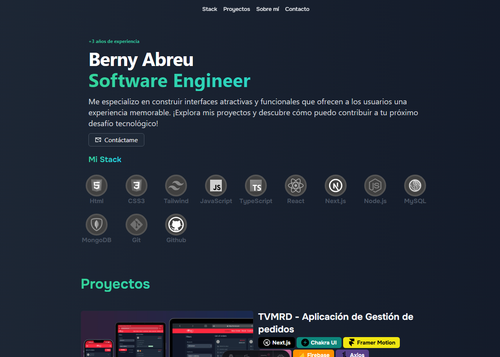

# 🌐 Portafolio Web

Este es mi portafolio personal como desarrollador frontend, construido con tecnologías modernas y pensado para ser rápido, accesible y visualmente atractivo.

## 🚀 Demo en vivo

🔗 [Ver portafolio en línea](https://bernyabreu.dev/)

## 🛠️ Tecnologías utilizadas

- [Astro](https://astro.build/)
- [Tailwind CSS](https://tailwindcss.com/)
- [Swiper](https://swiperjs.com/)

## 📸 Capturas

## 🧑 Sobre mí

Soy Berny Abreu, desarrollador frontend con más de 3 años de experiencia. Este portafolio representa una muestra de mis habilidades, proyectos reales y enfoque en crear interfaces efectivas y modernas.

## 📬 Contacto

- Email: [bernyabreu42@gmail.com](mailto:bernyabreu42@gmail.com)
- GitHub: [@Bernyabreu42](https://github.com/Bernyabreu42)

---

Gracias por visitar este repositorio. ¡Los aportes, sugerencias o estrellas ⭐ son bienvenidos!
